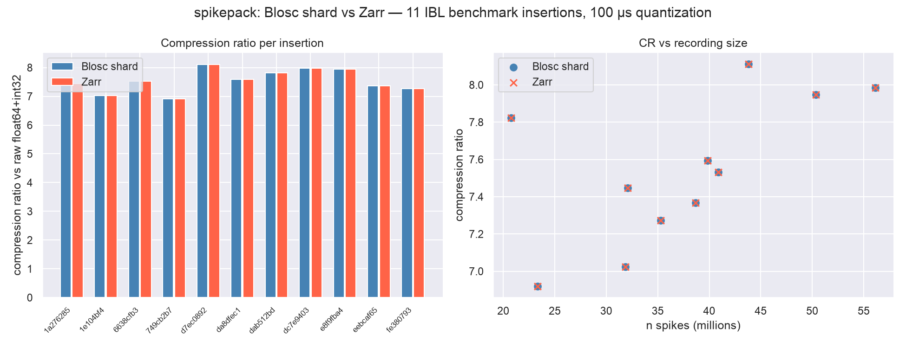

Same 11 insertions used for the [lfpack LFP benchmark gallery](https://int-brain-lab.github.io/lfpack/explanation/gallery.html),
loaded via `one.load_object(..., 'spikes', attribute=['times', 'clusters'])` — the
**full recording** (no good-unit filtering), so this reflects the harder,
noisier case: every detected spike, including multi-unit/noise clusters, not just
curated good units.

## Results

| PID | note | n spikes | n units | raw | Blosc | CR | Zarr | CR | max err (Blosc/Zarr) |
|---|---|---|---|---|---|---|---|---|---|
| `1a276285` | benchmark start | 32,060,951 | 1143 | 385 MB | 51.7 MB | **7.4x** | 51.7 MB | **7.4x** | 50.0/50.0 µs |
| `1e104bf4` |  | 31,854,038 | 1637 | 382 MB | 54.4 MB | **7.0x** | 54.4 MB | **7.0x** | 50.0/50.0 µs |
| `6638cfb3` |  | 40,880,660 | 1173 | 491 MB | 65.1 MB | **7.5x** | 65.1 MB | **7.5x** | 50.0/50.0 µs |
| `749cb2b7` |  | 23,306,962 | 1455 | 280 MB | 40.4 MB | **6.9x** | 40.4 MB | **6.9x** | 50.0/50.0 µs |
| `d7ec0892` |  | 43,828,058 | 783 | 526 MB | 64.8 MB | **8.1x** | 64.8 MB | **8.1x** | 50.0/50.0 µs |
| `da8dfec1` |  | 39,835,238 | 1143 | 478 MB | 62.9 MB | **7.6x** | 62.9 MB | **7.6x** | 50.0/50.0 µs |
| `dab512bd` | amazing CSD | 20,767,948 | 674 | 249 MB | 31.9 MB | **7.8x** | 31.9 MB | **7.8x** | 50.0/50.0 µs |
| `dc7e9403` | static noise: positive spikes | 56,118,695 | 1030 | 673 MB | 84.3 MB | **8.0x** | 84.3 MB | **8.0x** | 50.0/50.0 µs |
| `e8f9fba4` |  | 50,341,658 | 860 | 604 MB | 76.0 MB | **7.9x** | 76.0 MB | **7.9x** | 33.3/33.3 µs |
| `eebcaf65` |  | 38,673,521 | 1412 | 464 MB | 63.0 MB | **7.4x** | 63.0 MB | **7.4x** | 50.0/50.0 µs |
| `fe380793` | benchmark stop | 35,289,900 | 1400 | 423 MB | 58.2 MB | **7.3x** | 58.2 MB | **7.3x** | 50.0/50.0 µs |

Aggregate: 4.96 GB raw -> 0.65 GB Blosc
(**7.6x**) / 0.65 GB Zarr
(**7.6x**).

## Reading the numbers

- **Blosc and Zarr compress identically** — both wrap the same `encode_times` +
  Blosc(zstd, shuffle) codec, so any CR difference between the two columns above is
  container overhead (Zarr's per-array `zarr.json` metadata vs the hand-rolled
  `meta.json`), not a codec difference. At this scale the overhead is negligible.
- **Round-trip error never exceeds half a tick** (50 µs at this quantization) for
  either format, and cluster labels round-trip exactly (`labels_round_trip_ok` was
  `True` for all 11 insertions).
- **CR is lower than the `bwm_ephys`-reported values** because this benchmark
  compresses the *full* recording (all detected spikes) rather than the good-unit
  subset `bwm_ephys` ships — noise/MUA clusters fire less regularly than curated
  single units, so their inter-spike-interval deltas compress somewhat less well.

Reproduce with `scripts/benchmark_pids.py` (downloads real data, requires ONE/Alyx
access) followed by `scripts/build_benchmark_report.py`.
